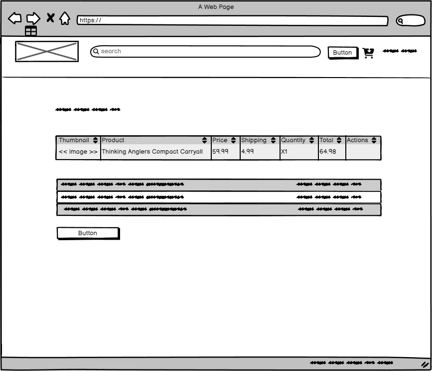

# Sell Your Tackle

### Use Case

A large fishing tackle shop chain has approach me to help them solve a business related problem they are facing regarding sales growth. As one of the largest chains, they already have the purchasing power to price new tackle competitively in the market, and have maxed out growth in this area. 

Their executive team has tasked the chief revenue officer to find new avenues for revenue growth. One area she is keen to grow into is the used tackle market. The executive team likes this idea, but they want to protect their brand equity by first testing the model under a different business name "Sell Your Tackle" while they learn the ins and outs of running a C2C business. ALthough they have understood the risk of this model cannibalising their new tackle sales, they believe the used tackle market is big enough so that sales from this segment outweigh any drop off in sales of new tackle.

They belive that the ability to provide their customer base with a more holistic solution will drive sales expodentially in the future, and futher solidify their spot as the numner 1 place to purchase fishign tackle in the UK. Their leadership team has approached me with a clear and well defined scope of exactly what they need, and have asked me to excecute the build for them

[Live Site](https://www.sellyourtackle.co.uk/)

## Project Scope

The scope of this project is to build a fully responsive platform which allows users to buy, list and sell fishing tackle to other users. To reduce the complexity of a project which is already complex, it has been agreed that the platform should only allow users to list products one by one. If they want to sell multiple products, they can list their items multiple items, or in a single listing with the amount in the title, i.e. 3x rods

### Site Owner Goals

* To take a 10% commission on all products sold through the platform
* To allow users to list, buy and sell tackle
* To grow their business in an area they previously have had no traction in
* To learn how to run a C2C business

### User Goals

* Free up cash by selling fishing tackle they no longer use
* Save money by buying use tackle, instead of brand new

## User Experience

### Target Audience

* The target audience is all of the 1m+ registered anglers in the UK
* This will include customers of their existing, new tackle platform

### User Requirements and Expectations

* Fully responsive
* Funds from sales should be sent directly to users bank accounts
* List tackle quickly and efficiently
* Message buyers and sellers if they have any issue/questions
* Buyer and seller protection from the marketplace owners

## User Stories

The user requirements given are in depth so I have marked each one with an M = must have, or an N = nice to have

### Users

### Selling

| Number | Action                                                   | M/N |
|--------|----------------------------------------------------------|-----|
| 1      | Login and create an account                              | M   |
| 2      | Use Google as an SSO                                     | N   |
| 3      | Change their username                                    | N   |
| 4      | Single form to list tackle                               | N   |
| 5      | Predefined brands and categories to speed up listing     | N   |
| 6      | Ability to upload images to product, regardless of size  | M   |
| 7      | Connect bank account to get paid                         | M   |
| 8      | Message buyers in case of order issues                   | M   |
| 9      | View past sales                                          | M   |
| 10     | See shipping information when an item is sold            | M   |
| 11     | Input tracking details and send to the buyer             | M   |
| 12     | Contact page for order disputes                          | M   |
| 13     | Responsive design for checking listings on the go        | N   |
| 14     | Edit or delete products unless sold                      | M   |
| 15     | Reset password in case of forgetting it                  | M   |
| 16     | Email notification once item is sold                     | M   |
| 17     | Refund orders if unable to ship                          | M   |

### Buying

| Number | Action                                                    | M/N |
|--------|-----------------------------------------------------------|-----|
| 18     | Login and create an account                               | M   |
| 19     | Use Google as an SSO                                      | N   |
| 20     | Reset password in case of forgetting it                   | M   |
| 21     | Area to view past orders                                  | M   |
| 22     | See tracking information once shipped                     | M   |
| 23     | View billing and shipping addresses                       | N   |
| 24     | Negate the need for duplicate address inputs at checkout  | N   |
| 25     | Different payment options at checkout                     | N   |
| 26     | Ability to message seller with questions                  | M   |
| 27     | Ability to message site admins for order help             | M   |

### Admin/Site Owner

| Number | Action                                         | M/N |
|--------|------------------------------------------------|-----|
| 28     | View and manage orders in admin dashboard      | M   |
| 29     | View and manage users in admin dashboard       | M   |
| 30     | View and manage products in admin dashboard    | M   |
| 31     | Refund orders on behalf of sellers             | M   |

### Project Management

* User Github Kanban to build the project development framework and timeframe
* Identify Epics and link each user story to an Epic
* Identify milestones and link each user story to a milestone
* Use user stories for each card
* Use backlog, in progress and done as statuses

Epics

User Stories

Milestones

Kanban Board

## Structure

### Code Structure

The application is built using the DJango framework, and is broken up into 4 main apps to help with future maintaince, code transparency and further feature building

* admin_app - this houses all the admin dashboard functionality
* auth_app - this houses all the authentication functionality, including login, logout, registration, password reset and allauth for SSO
* sellyourtackle - the houses the main app setting and master URL file 
* tackle - the houses all the functionality related to listing, selling and buying tackle

Within these apps you will find a models.py file, which contains all the models used in the app,a views.py file which contains all the views used in the app, and a urls.py file which contains all the URLs used in the app. When it makes sense to do so, files have been created to silo specific functionality, such as the stripe.py file sound in the auth_app. This file manages the Stripe webhook and user account creation

Within the tackle and auth_app you will also find the relevant templates for each related page. 

Along with the apps, there is a:

* template folder - houses the base template and the landing page template
* verification-files folder- holds the apple pay verificatio file needed for enabling Apple Pay on the checkout
* static folder - houses all the static files, such as site images (but not product images), css and javascript
* Procfile - hosts the gunicorn setting for Heroku
* manage.py - manages the database and the app
* requirements.txt - list of thrid party libraries required to be installed when deployed

### Environment Variables

Enviroment variables are stored in a.env file, which is not tracked by git. This file contains all the sensitive information for the app, such as the database credentials. Once the app is deployed, the.env file is not tracked, and this sensitive information is stored in the Heroku environment variables.

### Product Images

Product images are stored in an AWS S3 bucket. This is to reduce server space and page load times

### Database Structure

The database used is a postgresql db hosted at neon.tech. 

# Models Documentation

The following models were created to represent the database structure for the Tackle application within the website:

## Brand Model

Represents different brands of fishing tackle available within the application.

- **Fields**:
  - `name`: Stores the brand's name.

## Category Model

Represents various categories of fishing tackle.

- **Fields**:
  - `name`: Stores the category's name.
  - `condition_choices`: Enumerates the condition of the tackle (Perfect, Excellent, Good, Fair).
  - `financial_status_choices`: Enumerates the financial status (Unsold, Sold, Draft, Live).

## Product Model

Represents the products being sold on the application.

- **Fields**:
  - `name`: Stores the product's name.
  - `slug`: Stores URL-friendly identifiers for the product.
  - `variation1`: Stores the first variation detail of the product.
  - `variation2`: Stores the second variation detail of the product.
  - `condition`: Stores the condition of the product based on predefined choices.
  - `description`: Stores a detailed description of the product.
  - `created_at`: Records the date and time the product was created.
  - `price`: Stores the price of the product.
  - `shipping`: Stores the shipping cost of the product.
- **Relationships**:
  - `brand`: Links to the Brand model.
  - `category`: Links to the Category model.
  - `user`: Links to the User model from the `auth_app`.
- **Methods**:
  - `is_in_stock()`: Checks if the product is in stock.
  - `save(*args, **kwargs)`: Customizes the save operation.
  - `total_with_shipping()`: Calculates the total price including shipping.

## ProductImage Model

Represents images associated with products.

- **Fields**:
  - `image`: Stores the image file.
- **Relationships**:
  - `product`: Links to the Product model.

## WebhookLog Model

Used for logging webhook events related to orders.

- **Fields**:
  - `payment_intent_id`: Stores the payment intent ID.
  - `received_at`: Records when the event was received.
  - `payload`: Stores the webhook payload.
  - `header`: Stores the webhook header.
  - `status`: Stores the status of the webhook event.
  - `event_type`: Stores the type of the webhook event.
- **Relationships**:
  - `order`: Optionally links to an Order model, can be set to NULL on order deletion.

## Address Model

Represents user addresses.

- **Fields**:
  - `address_type`: Specifies the type of address (e.g., billing or shipping).
  - `first_name`: Stores the user's first name.
  - `last_name`: Stores the user's last name.
  - `email`: Stores the user's email address.
  - `phone_number`: Stores the user's phone number.
  - `address_line1`: Stores the address.
  - `address_line2`: Stores additional address details.
  - `city`: Stores the city.
  - `state`: Stores the state.
  - `postal_code`: Stores the postal code.
- **Relationships**:
  - `user`: Links to the User model.

## EmailConfirmationToken Model

Represents email confirmation tokens for verifying user's email addresses.

- **Fields**:
  - `token`: Stores the email confirmation token.
- **Relationships**:
  - `user`: Links to the User model.

## Order Model

Represents orders placed by users.

- **Fields**:
  - `product_cost`: Stores the cost of the product.
  - `shipping_cost`: Stores the shipping cost.
  - `total_amount`: Stores the total amount of the order.
  - `status`: Stores the order status.
  - `payment_status`: Stores the payment status.
  - `payment_intent_id`: Stores the payment intent ID.
  - `created_at`: Records when the order was created.
  - `updated_at`: Records when the order was updated.
  - `tracking_number`: Stores the tracking number.
  - `tracking_company`: Stores the tracking company.
- **Relationships**:
  - `user`: Links to the User model.
  - `shipping_address`: Links to the Address model for shipping.
  - `billing_address`: Links to the Address model for billing.

## OrderItem Model

Represents items within an order.

- **Fields**:
  - `price`: Stores the price of the item.
  - `quantity`: Stores the quantity of the item.
  - `shipping_cost`: Stores the shipping cost of the item.
- **Relationships**:
  - `order`: Links to the Order model.
  - `product`: Links to the Product model.
  - `seller`: Links to the User model.
- **Methods**:
  - `get_total_item_price()`: Calculates the total price for the item.
  - `get_total_item_price_with_shipping()`: Calculates the total price for the item including shipping.

## PasswordResetToken Model

Represents password reset tokens.

- **Fields**:
  - `token`: Stores the password reset token.
  - `created_at`: Records when the token was created.
  - `is_used`: Indicates if the token has been used.
- **Relationships**:
  - `user`: Links to the User model.
- **Methods**:
  - `is_expired()`: Checks if the token has expired.

## User Model (CustomUser)

Represents users within the application with custom fields and behavior.

- **Fields**:
  - `email`: Stores the user's email and is used as the unique identifier for login.
  - `first_name`: Stores the user's first name.
  - `last_name`: Stores the user's last name.
  - `username`: Stores the user's username.
  - `date_joined`: Records when the user account was created.
  - `is_active`: Indicates whether the user's account is active.
  - `is_staff`: Indicates whether the user can access the admin site.
  - `stripe_account_id`: Stores the Stripe account ID if the user has connected a Stripe account.
  - `is_stripe_verified`: Indicates whether the user's Stripe account has been verified.
  - `balance`: Stores the user's balance for transactions within the application.

- **Methods**:
  - `create_user(email, password, **extra_fields)`: Creates a new user with the given email and password.
  - `create_superuser(email, password, **extra_fields)`: Creates a new superuser with the given email and password.
  - `__str__()`: Returns the user's email.

These models are visually represented by the ERD below:

## Design

### Colours

Taking inspiration from Reverb, a marketplace for used musical instruments, I wanted a colour theme which reflected calm and traniqulity to reflect the serenity and peacefulness associate with going fishing. I chose a a soft peach colour as the main colour and wanted a few few contrasting colours to go help highlight important areas

### Fonts 

As the main font I choose the Google font Poppins. Poppins is described as the "geometric shapes keep the type readable in small sizes, while its modern yet timeless curves look striking when blown up on big screens or mobile devices. It's perfect for web and UI designs that demand style, clarity, and legibility".

This description met my criteria for a font. 

### Wireframes

404

Account Settings

Buyer Order Page

Buying Selling

Cart

Checkout

Connect Stripe

Edit Product

Forgot Password

Form

Order Confirmation

Home

Login

Product Page

Product Sold

Reset Password

Sign Up

## Technologies Used

### Languages and Frameworks

* HTML
* CSS
* Javascript
* Python
* Django

### Libraries and Tools

* Am I Responsive
* AWS S3 Bucket
* Balsamiq
* Bootstrap v5.2 
* Cloudinary
* Favicon.io
* Chrome dev tools
* Font Awesome
* Git
* GitHub
* Google Fonts
* Heroku Platform
* jQuery
* Postgres
* Stripe
* AWS SES

## Validation

### HTML

Using The W3C Markup Validation Service

* <a href="https://validator.w3.org/nu/?doc=https%3A%2F%2Fwww.sellyourtackle.co.uk%2F">Index</a>
* <a href="https://validator.w3.org/nu/?doc=https%3A%2F%2Fwww.sellyourtackle.co.uk%2Fauth%2Flogin%2F">Login</a>
* <a href="https://validator.w3.org/nu/?doc=https%3A%2F%2Fwww.sellyourtackle.co.uk%2Fauth%2Fsignup%2F">Sign Up</a>
* <a href="https://validator.w3.org/nu/?doc=https%3A%2F%2Fwww.sellyourtackle.co.uk%2Fauth%2Fabout-us">About Us</a>

Buying

Selling

* <a href="https://validator.w3.org/nu/?doc=https%3A%2F%2Fwww.sellyourtackle.co.uk%2Fauth%2Fcontact%2F">Contact Us</a>
* <a href="https://validator.w3.org/nu/?doc=https%3A%2F%2Fwww.sellyourtackle.co.uk%2Fauth%2Fprivacy%2F">Privacy</a>
* <a href="https://validator.w3.org/nu/?doc=https%3A%2F%2Fwww.sellyourtackle.co.uk%2Fauth%2Fterms%2F">Terms</a>

Account Settings

* <a href="https://validator.w3.org/nu/?doc=https%3A%2F%2Fwww.sellyourtackle.co.uk%2Fauth%2Freset-password%2F#l330c17">Reset Password</a>

Cart

Checkout

Order Page Buyer

### Accessibility

Accessibility of the website was tested using the WAVE web accessibility evaluation tool.

Index

Login

Sign Up

About Us

Contact Us

Privacy

Terms

Reset Password

