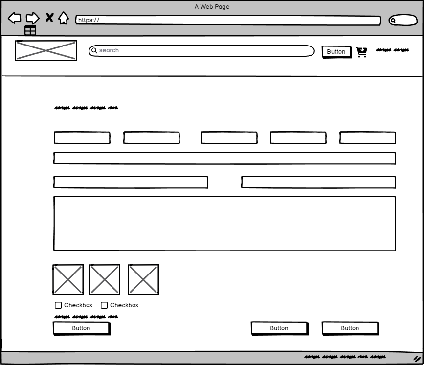

# Sell Your Tackle

### Use Case

A large fishing tackle shop chain has approach me to help them solve a business related problem they are facing regarding sales growth. As one of the largest chains, they already have the purchasing power to price new tackle competitively in the market, and have maxed out growth in this area. 

Their executive team has tasked the chief revenue officer to find new avenues for revenue growth. One area she is keen to grow into is the used tackle market. The executive team likes this idea, but they want to protect their brand equity by first testing the model under a different business name "Sell Your Tackle" while they learn the ins and outs of running a C2C business. ALthough they have understood the risk of this model cannibalising their new tackle sales, they believe the used tackle market is big enough so that sales from this segment outweigh any drop off in sales of new tackle.

They belive that the ability to provide their customer base with a more holistic solution will drive sales expodentially in the future, and futher solidify their spot as the numner 1 place to purchase fishign tackle in the UK. Their leadership team has approached me with a clear and well defined scope of exactly what they need, and have asked me to excecute the build for them

[Live Site](https://www.sellyourtackle.co.uk/)

## Project Scope

The scope of this project is to build a fully responsive platform which allows users to buy, list and sell fishing tackle to other users. To reduce the complexity of a project which is already complex, it has been agreed that the platform should only allow users to list products one by one. If they want to sell multiple products, they can list their items multiple items, or in a single listing with the amount in the title, i.e. 3x rods

### Site Owner Goals

* To take a 10% commission on all products sold through the platform
* To allow users to list, buy and sell tackle
* To grow their business in an area they previously have had no traction in
* To learn how to run a C2C business

### User Goals

* Free up cash by selling fishing tackle they no longer use
* Save money by buying use tackle, instead of brand new

## User Experience

### Target Audience

* The target audience is all of the 1m+ registered anglers in the UK
* This will include customers of their existing, new tackle platform

### User Requirements and Expectations

* Fully responsive
* Funds from sales should be sent directly to users bank accounts
* List tackle quickly and efficiently
* Message buyers and sellers if they have any issue/questions
* Buyer and seller protection from the marketplace owners

## User Stories

The user requirements given are in depth so I have marked each one with an M = must have, or an N = nice to have

### Users

### Selling

| Number | Action                                                   | M/N |
|--------|----------------------------------------------------------|-----|
| 1      | Login and create an account                              | M   |
| 2      | Use Google as an SSO                                     | N   |
| 3      | Change their username                                    | N   |
| 4      | Single form to list tackle                               | N   |
| 5      | Predefined brands and categories to speed up listing     | N   |
| 6      | Ability to upload images to product, regardless of size  | M   |
| 7      | Connect bank account to get paid                         | M   |
| 8      | Message buyers in case of order issues                   | M   |
| 9      | View past sales                                          | M   |
| 10     | See shipping information when an item is sold            | M   |
| 11     | Input tracking details and send to the buyer             | M   |
| 12     | Contact page for order disputes                          | M   |
| 13     | Responsive design for checking listings on the go        | N   |
| 14     | Edit or delete products unless sold                      | M   |
| 15     | Reset password in case of forgetting it                  | M   |
| 16     | Email notification once item is sold                     | M   |
| 17     | Refund orders if unable to ship                          | M   |

### Buying

| Number | Action                                                    | M/N |
|--------|-----------------------------------------------------------|-----|
| 18     | Login and create an account                               | M   |
| 19     | Use Google as an SSO                                      | N   |
| 20     | Reset password in case of forgetting it                   | M   |
| 21     | Area to view past orders                                  | M   |
| 22     | See tracking information once shipped                     | M   |
| 23     | Negate the need for duplicate address inputs at checkout  | N   |
| 24     | Different payment options at checkout                     | N   |
| 25     | Ability to message seller with questions                  | M   |
| 26     | Ability to message site admins for order help             | M   |

### Admin/Site Owner

| Number | Action                                         | M/N |
|--------|------------------------------------------------|-----|
| 27     | View and manage orders in admin dashboard      | M   |
| 28     | View and manage users in admin dashboard       | M   |
| 29     | View and manage products in admin dashboard    | M   |
| 30     | Refund orders on behalf of sellers             | M   |

### Project Management

* User Github Kanban to build the project development framework and timeframe
* Identify Epics and link each user story to an Epic
* Identify milestones and link each user story to a milestone
* Use user stories for each card
* Use backlog, in progress and done as statuses

Epics

User Stories

Milestones

Kanban Board

## Design

### Colours

Taking inspiration from Reverb, a marketplace for used musical instruments, I wanted a colour theme which reflected calm and traniqulity to reflect the serenity and peacefulness associate with going fishing. I chose a a soft peach colour as the main colour and wanted a few few contrasting colours to go help highlight important areas

### Fonts 

As the main font I choose the Google font Poppins. Poppins is described as the "geometric shapes keep the type readable in small sizes, while its modern yet timeless curves look striking when blown up on big screens or mobile devices. It's perfect for web and UI designs that demand style, clarity, and legibility".

This description met my criteria for a font. 

### Wireframes

404

Account Settings

Buyer Order Page

Buying Selling

Cart

Checkout

Connect Stripe

Edit Product

Forgot Password

Form

Order Confirmation

Home

Login

Product Page

Product Sold

Reset Password

Sign Up

## Structure

### Code Structure

The application is built using the DJango framework, and is broken up into 4 main apps to help with future maintaince, code transparency and further feature building

* admin_app - this houses all the admin dashboard functionality
* auth_app - this houses all the authentication functionality, including login, logout, registration, password reset and allauth for SSO
* sellyourtackle - the houses the main app setting and master URL file 
* tackle - the houses all the functionality related to listing, selling and buying tackle

Within these apps you will find a models.py file, which contains all the models used in the app,a views.py file which contains all the views used in the app, and a urls.py file which contains all the URLs used in the app. When it makes sense to do so, files have been created to silo specific functionality, such as the stripe.py file sound in the auth_app. This file manages the Stripe webhook and user account creation

Within the tackle and auth_app you will also find the relevant templates for each related page. 

Along with the apps, there is a:

* template folder - houses the base template and the landing page template
* verification-files folder- holds the apple pay verificatio file needed for enabling Apple Pay on the checkout
* static folder - houses all the static files, such as site images (but not product images), css and javascript
* Procfile - hosts the gunicorn setting for Heroku
* manage.py - manages the database and the app
* requirements.txt - list of thrid party libraries required to be installed when deployed

### Environment Variables

Enviroment variables are stored in a.env file, which is not tracked by git. This file contains all the sensitive information for the app, such as the database credentials. Once the app is deployed, the.env file is not tracked, and this sensitive information is stored in the Heroku environment variables.

### Product Images

Product images are stored in an AWS S3 bucket. This is to reduce server space and page load times

### Database Structure

The database used is a postgresql db hosted at neon.tech. 

# Models Documentation

The following models were created to represent the database structure for the Tackle application within the website:

## Brand Model

Represents different brands of fishing tackle available within the application.

- **Fields**:
  - `name`: Stores the brand's name.

## Category Model

Represents various categories of fishing tackle.

- **Fields**:
  - `name`: Stores the category's name.
  - `condition_choices`: Enumerates the condition of the tackle (Perfect, Excellent, Good, Fair).
  - `financial_status_choices`: Enumerates the financial status (Unsold, Sold, Draft, Live).

## Product Model

Represents the products being sold on the application.

- **Fields**:
  - `name`: Stores the product's name.
  - `slug`: Stores URL-friendly identifiers for the product.
  - `variation1`: Stores the first variation detail of the product.
  - `variation2`: Stores the second variation detail of the product.
  - `condition`: Stores the condition of the product based on predefined choices.
  - `description`: Stores a detailed description of the product.
  - `created_at`: Records the date and time the product was created.
  - `price`: Stores the price of the product.
  - `shipping`: Stores the shipping cost of the product.
- **Relationships**:
  - `brand`: Links to the Brand model.
  - `category`: Links to the Category model.
  - `user`: Links to the User model from the `auth_app`.
- **Methods**:
  - `is_in_stock()`: Checks if the product is in stock.
  - `save(*args, **kwargs)`: Customizes the save operation.
  - `total_with_shipping()`: Calculates the total price including shipping.

## ProductImage Model

Represents images associated with products.

- **Fields**:
  - `image`: Stores the image file.
- **Relationships**:
  - `product`: Links to the Product model.

## WebhookLog Model

Used for logging webhook events related to orders.

- **Fields**:
  - `payment_intent_id`: Stores the payment intent ID.
  - `received_at`: Records when the event was received.
  - `payload`: Stores the webhook payload.
  - `header`: Stores the webhook header.
  - `status`: Stores the status of the webhook event.
  - `event_type`: Stores the type of the webhook event.
- **Relationships**:
  - `order`: Optionally links to an Order model, can be set to NULL on order deletion.

## Address Model

Represents user addresses.

- **Fields**:
  - `address_type`: Specifies the type of address (e.g., billing or shipping).
  - `first_name`: Stores the user's first name.
  - `last_name`: Stores the user's last name.
  - `email`: Stores the user's email address.
  - `phone_number`: Stores the user's phone number.
  - `address_line1`: Stores the address.
  - `address_line2`: Stores additional address details.
  - `city`: Stores the city.
  - `state`: Stores the state.
  - `postal_code`: Stores the postal code.
- **Relationships**:
  - `user`: Links to the User model.

## EmailConfirmationToken Model

Represents email confirmation tokens for verifying user's email addresses.

- **Fields**:
  - `token`: Stores the email confirmation token.
- **Relationships**:
  - `user`: Links to the User model.

## Order Model

Represents orders placed by users.

- **Fields**:
  - `product_cost`: Stores the cost of the product.
  - `shipping_cost`: Stores the shipping cost.
  - `total_amount`: Stores the total amount of the order.
  - `status`: Stores the order status.
  - `payment_status`: Stores the payment status.
  - `payment_intent_id`: Stores the payment intent ID.
  - `created_at`: Records when the order was created.
  - `updated_at`: Records when the order was updated.
  - `tracking_number`: Stores the tracking number.
  - `tracking_company`: Stores the tracking company.
- **Relationships**:
  - `user`: Links to the User model.
  - `shipping_address`: Links to the Address model for shipping.
  - `billing_address`: Links to the Address model for billing.

## OrderItem Model

Represents items within an order.

- **Fields**:
  - `price`: Stores the price of the item.
  - `quantity`: Stores the quantity of the item.
  - `shipping_cost`: Stores the shipping cost of the item.
- **Relationships**:
  - `order`: Links to the Order model.
  - `product`: Links to the Product model.
  - `seller`: Links to the User model.
- **Methods**:
  - `get_total_item_price()`: Calculates the total price for the item.
  - `get_total_item_price_with_shipping()`: Calculates the total price for the item including shipping.

## PasswordResetToken Model

Represents password reset tokens.

- **Fields**:
  - `token`: Stores the password reset token.
  - `created_at`: Records when the token was created.
  - `is_used`: Indicates if the token has been used.
- **Relationships**:
  - `user`: Links to the User model.
- **Methods**:
  - `is_expired()`: Checks if the token has expired.

## User Model (CustomUser)

Represents users within the application with custom fields and behavior.

- **Fields**:
  - `email`: Stores the user's email and is used as the unique identifier for login.
  - `first_name`: Stores the user's first name.
  - `last_name`: Stores the user's last name.
  - `username`: Stores the user's username.
  - `date_joined`: Records when the user account was created.
  - `is_active`: Indicates whether the user's account is active.
  - `is_staff`: Indicates whether the user can access the admin site.
  - `stripe_account_id`: Stores the Stripe account ID if the user has connected a Stripe account.
  - `is_stripe_verified`: Indicates whether the user's Stripe account has been verified.
  - `balance`: Stores the user's balance for transactions within the application.

- **Methods**:
  - `create_user(email, password, **extra_fields)`: Creates a new user with the given email and password.
  - `create_superuser(email, password, **extra_fields)`: Creates a new superuser with the given email and password.
  - `__str__()`: Returns the user's email.

These models are visually represented by the ERD below:

## Features

### Account Creation & Login

* User can create an account via email
* User can create an account using Google SSO
* User can login via email
* User can login via SSO

User stories: 1, 2, 18, 20, 19

[Watch the Video](https://www.loom.com/share/e23c32c8354e4aceb6673c5b3bb71d7e?sid=34aea5c1-f325-4e32-a5f2-74496210758b)

### Password Reset

* Users can reset their password if they forget it

[Watch the Video](https://www.loom.com/share/92aaceb7549b47d29293fe0cf1489d43?sid=81db6b9f-f566-404f-bafd-73592ba47017)

User stories 15, 21

### List item for sale

* Users have to have an account to list a product
* Users have to have connected a Stripe account to list a porduct or they will not be able to get paid
* Users have to choose spefic categories and brands from a predetermined data set
* Users just need a single form to list

User stories 4, 5, 6, 7, 

[Watch the Video](https://www.loom.com/share/aaa662167d904660adce13185f4ae45f?sid=dab718ef-ffb9-49d1-832d-26ebae015893)

### Seller and Account Area

* View products listed for sale
* Check is product has been sold
* View past sales

User stories 3, 9, 13

[Watch the Video](https://www.loom.com/share/59607f5e429a433cbe7823561ace51a5?sid=22dc6d67-e707-40cb-b3ce-2bbbb201679c)

### Selling Management

* See where to ship an order
* Input tracking information
* Mark order as dispatched
* Contact buyer in case of an issue
* Refund order if necessary
* Edit products if not sold

User stories 8, 10, 11, 14, 17

[Watch the Video](https://www.loom.com/share/f6206b4b263e41b7a3e95c7eabdf345a?sid=07440ff6-bc11-407b-b3b1-ea82bd1ab509)

### Contact Page

* Buyers or sellers can contact sell your tackle to help solve any order related or platform related issues

[Watch the Video](https://www.loom.com/share/c11fb73716ce4c689ab3dcf8ceb5447e?sid=a62784c1-ee4e-4d01-a2bb-242b7b18cc80)

User stories 12, 26

### Delete products

* I can delete a product as a seller if it has not been sold
* Double optin for delete so as to not delete a product my accident

[Watch the Video](https://www.loom.com/share/5a7a15dc706047f993ec7add82b1d0d7?sid=d125b8c8-d8c8-4420-bdc8-af6f015e034e)

User story 14

### Buyer Area

* View purchases
* See tracking once shipped

[Watch the Video](https://www.loom.com/share/5a7a15dc706047f993ec7add82b1d0d7?sid=d125b8c8-d8c8-4420-bdc8-af6f015e034e)

User stories 21, 22, 25

### Cart & Checkout Page

* View items in cart and shipping totals before purchasing
* Input shipping and billing address. If addresses are the same then no need to input twice
* If you are logged in it will retrieve last shipping & billing information
* Different payment options - Apple Pay, Google Pay, Credit Card, Paypal

[Watch the Video](https://www.loom.com/share/986b065b59f944dfb213efb137805c6b?sid=61381892-48cc-4770-97bd-f41e36ea3a79)

User Stories 23, 24

### Admin Dashboard

* View and manage orders
* View and manage users
* View and manage products
* Refund orders on behalf of sellers

[Watch the Video](https://www.loom.com/share/c874b54711c64f5fb0ed2b222d345d3a?sid=b4553a6b-a614-46f6-abbe-e24af9ec36ed)

User Stories 27, 28, 29 30

## Technologies Used

### Languages and Frameworks

* HTML
* CSS
* Javascript
* Python
* Django

### Libraries and Tools

* Am I Responsive
* AWS S3 Bucket
* Balsamiq
* Bootstrap v5.2 
* Cloudinary
* Favicon.io
* Chrome dev tools
* Font Awesome
* Git
* GitHub
* Google Fonts
* Heroku Platform
* jQuery
* Postgres via neon.tech
* Stripe
* AWS SES

## Validation

### HTML

Using The W3C Markup Validation Service

* <a href="https://validator.w3.org/nu/?doc=https%3A%2F%2Fwww.sellyourtackle.co.uk%2F">Index</a>
* <a href="https://validator.w3.org/nu/?doc=https%3A%2F%2Fwww.sellyourtackle.co.uk%2Fauth%2Flogin%2F">Login</a>
* <a href="https://validator.w3.org/nu/?doc=https%3A%2F%2Fwww.sellyourtackle.co.uk%2Fauth%2Fsignup%2F">Sign Up</a>
* <a href="https://validator.w3.org/nu/?doc=https%3A%2F%2Fwww.sellyourtackle.co.uk%2Fauth%2Fabout-us">About Us</a>
* <a href="https://validator.w3.org/nu/?doc=https%3A%2F%2Fwww.sellyourtackle.co.uk%2Fauth%2Fcontact%2F">Contact Us</a>
* <a href="https://validator.w3.org/nu/?doc=https%3A%2F%2Fwww.sellyourtackle.co.uk%2Fauth%2Fprivacy%2F">Privacy</a>
* <a href="https://validator.w3.org/nu/?doc=https%3A%2F%2Fwww.sellyourtackle.co.uk%2Fauth%2Fterms%2F">Terms</a>
* <a href="https://validator.w3.org/nu/?doc=https%3A%2F%2Fwww.sellyourtackle.co.uk%2Fauth%2Freset-password%2F#l330c17">Reset Password</a>
* <a href="https://validator.w3.org/nu/?doc=https%3A%2F%2Fwww.sellyourtackle.co.uk%2Fproduct%2Fkorda-ajcket">Product Page</a>

Buying

Selling

Account Settings

Cart

Checkout

Order Page Buyer

List Product

Seller Product Page Not Sold

Seller Product Page Sold

Shop

### Accessibility

Accessibility of the website was tested using the WAVE web accessibility evaluation tool.

Index

Login

Sign Up

About Us

Contact Us

Privacy

Terms

Reset Password

Buying

Selling

Account Settings

Cart

Checkout

Order Page Buyer

List Product

Seller Product Page Not Sold

Seller Product Page Sold

Product Page

Shop

### CSS

Tested using the W3C Css Validation Service tool.

CSS Validation

### Javascript

Tested using the JSHint JS Validation Service.

checkout.js - the undefined Stripe variable is called using the  tag in the HTML of the checkout page. The unused 'moveToPaymentStep' is used in the move to payment button in the HTML of the checkout page:

  <!-- <button type="button" class="btn btn-outline-main mt-3" onclick="moveToPaymentStep()">Move to
      Payment</button> !-->

Checkout JS

General JS

List Products JS

Signup JS

### Python

CI Python Linter was used to check for PEP8 compliance.

#### Admin App

admin.py

#### Auth App

email.py

forms.py

models.py

stripe.py

views.py

test.py

urls.py

#### Tackle App

forms.py

models.py

test.py

urls.py

views.py

## Testing

### Automated unit testing

* Testing using Django unittest
* Two test files can be found in the tackle and auth app
* To run call python manage.py test in the terminal

#### Models Tests
- **CategoryModelTest**
  - Tests the creation of a Category instance.

#### Form Tests
- **CheckoutFormTest**
  - Validates the Checkout form with correct data input.
- **ContactSellerFormTest**
  - Validates the Contact Seller form with correct data input.
- **CustomUserSignupFormTest**
  - Validates the Custom User Signup form with both valid and invalid data input.
- **ContactFormTest**
  - Validates the Contact form with correct data input.
- **PasswordResetRequestFormTest**
  - Validates the Password Reset Request form with correct data input.
- **SetNewPasswordFormTest**
  - Validates the Set New Password form with correct data input.

#### View Tests
- **SearchViewTest**
  - Tests the search view for correct HTTP response.
- **ShopViewTest**
  - Tests the shop view for correct HTTP response.
- **ConfirmEmailViewTest**
  - Tests email confirmation process and user activation.
- **BuyingViewTest**
  - Tests the buying view for correct HTTP response and template usage.

#### CustomUser Model Test
- **CustomUserModelTest**
  - Tests the creation of a CustomUser instance.

#### Stripe Integration Tests
- **StripeIntegrationTest**
  - Tests the Stripe integration, including account link creation, account retrieval, and user Stripe verification.

Unit Test Results

All tests pass with "OK" status

### Manual Testing

#### Selling

1. **Login and create an account**
   
   **Step** | **Expected Result** | **Actual Result**
   ---------|---------------------|----------------
   | Navigate to 'Login/Register' | Registration/Login page loads | Works as expected |
   | Attempt to register a new account | Account is created and user is logged in | Works as expected |

2. **Use Google as an SSO**
   
   **Step** | **Expected Result** | **Actual Result**
   ---------|---------------------|----------------
   | Click on 'Login with Google' | Google SSO process initiates | Works as expected |
   | Complete Google SSO process | User is logged in through Google account | Works as expected |

3. **Change their username**
   
   **Step** | **Expected Result** | **Actual Result**
   ---------|---------------------|----------------
   | Navigate to user profile/settings | Profile/Settings page loads | Works as expected |
   | Update username and save changes | Username is updated successfully | Works as expected |

4. **Single form to list tackle**
   
   **Step** | **Expected Result** | **Actual Result**
   ---------|---------------------|----------------
   | Navigate to 'List New Tackle' form | Tackle listing form loads | Works as expected |
   | Fill out the form and submit | New tackle listing is created | Works as expected |

5. **Predefined brands and categories to speed up listing**
   
   **Step** | **Expected Result** | **Actual Result**
   ---------|---------------------|----------------
   | Open the listing form | Form with predefined options for brands and categories is visible | Works as expected |
   | Select options from predefined lists and submit | Listing is created with selected predefined options | Works as expected |

6. **Ability to upload images to product, regardless of size**
   
   **Step** | **Expected Result** | **Actual Result**
   ---------|---------------------|----------------
   | Navigate to product listing form | Product listing form is accessible | Works as expected |
   | Upload image of any size and submit | Image is uploaded successfully | Works as expected |

7. **Connect bank account to get paid**
   
   **Step** | **Expected Result** | **Actual Result**
   ---------|---------------------|----------------
   | Navigate to payment settings | Payment settings page loads | Works as expected |
   | Connect a bank account | Bank account is connected successfully | Works as expected |

8. **Message buyers in case of order issues**
   
   **Step** | **Expected Result** | **Actual Result**
   ---------|---------------------|----------------
   | Navigate to the order page | Order details page loads | Works as expected |
   | Send message to buyer | Message is sent successfully | Works as expected |

9. **View past sales**
   
   **Step** | **Expected Result** | **Actual Result**
   ---------|---------------------|----------------
   | Navigate to sales history | Sales history page loads | Works as expected |
   | View list of past sales | Past sales are displayed correctly | Works as expected |

10. **See shipping information when an item is sold**
   
   **Step** | **Expected Result** | **Actual Result**
   ---------|---------------------|----------------
   | Navigate to sold item details | Sold item details page loads | Works as expected |
   | View shipping information | Shipping information is displayed correctly | Works as expected |

11. **Input tracking details and send to the buyer**
   
   **Step** | **Expected Result** | **Actual Result**
   ---------|---------------------|----------------
   | Navigate to sold item details | Sold item details page loads | Works as expected |
   | Input tracking details and update | Tracking details are updated and sent to the buyer | Works as expected |

12. **Contact page for order disputes**
   
   **Step** | **Expected Result** | **Actual Result**
   ---------|---------------------|----------------
   | Navigate to the contact page | Contact page loads | Works as expected |
   | Submit an order dispute | Order dispute is submitted successfully | Works as expected |

13. **Responsive design for checking listings on the go**
   
   **Step** | **Expected Result** | **Actual Result**
   ---------|---------------------|----------------
   | Access website on a mobile device | Website is responsive and usable on mobile | Works as expected |

14. **Edit or delete products unless sold**
   
   **Step** | **Expected Result** | **Actual Result**
   ---------|---------------------|----------------
   | Navigate to product details | Product details page loads | Works as expected |
   | Edit or delete the product | Product is edited or deleted successfully | Works as expected |

15. **Reset password in case of forgetting it**
   
   **Step** | **Expected Result** | **Actual Result**
   ---------|---------------------|----------------
   | Click on 'Forgot Password' | Password reset form/page loads | Works as expected |
   | Submit email for password reset | Password reset instructions are sent to email | Works as expected |

16. **Email notification once item is sold**
   
   **Step** | **Expected Result** | **Actual Result**
   ---------|---------------------|----------------
   | Sell an item | Email notification about the sale is received | Works as expected |

17. **Refund orders if unable to ship**
   
   **Step** | **Expected Result** | **Actual Result**
   ---------|---------------------|----------------
   | Navigate to sold item details | Sold item details page loads | Works as expected |
   | Initiate a refund | Refund is processed successfully | Works as expected |

#### Buying

18. **Login and create an account**
   
   *Same steps as in Selling section.*

19. **Use Google as an SSO**
   
   *Same steps as in Selling section.*

20. **Reset password in case of forgetting it**
   
   *Same steps as in Selling section.*

21. **Area to view past orders**
   
   **Step** | **Expected Result** | **Actual Result**
   ---------|---------------------|----------------
   | Navigate to user profile | Profile page with order history loads | Works as expected |
   | View order history | List of past orders is displayed | Works as expected |

22. **See tracking information once shipped**
   
   **Step** | **Expected Result** | **Actual Result**
   ---------|---------------------|----------------
   | Navigate to purchased item details | Purchased item details page loads | Works as expected |
   | View tracking information | Tracking information is displayed correctly | Works as expected |

23. **Negate the need for duplicate address inputs at checkout**
   
   **Step** | **Expected Result** | **Actual Result**
   ---------|---------------------|----------------
   | Proceed to checkout | Checkout page loads with pre-filled address details | Works as expected |

24. **Different payment options at checkout**
   
   **Step** | **Expected Result** | **Actual Result**
   ---------|---------------------|----------------
   | Navigate to checkout | Checkout page loads | Works as expected |
   | Select different payment options | Payment options are selectable and functional | Works as expected |

25. **Ability to message seller with questions**
   
   **Step** | **Expected Result** | **Actual Result**
   ---------|---------------------|----------------
   | Navigate to a product page | Product page loads | Works as expected |
   | Send a message to the seller | Message is sent successfully | Works as expected |

26. **Ability to message site admins for order help**
   
   **Step** | **Expected Result** | **Actual Result**
   ---------|---------------------|----------------
   | Navigate to the contact page | Contact page loads | Works as expected |
   | Send a message to site admins | Message is sent successfully | Works as expected |

### Admin/Site Owner

27. **View and manage orders in admin dashboard**
   
   **Step** | **Expected Result** | **Actual Result**
   ---------|---------------------|----------------
   | Access admin dashboard | Admin dashboard is accessible | Works as expected |
   | View and manage orders | Orders are viewable and manageable | Works as expected |

28. **View and manage users in admin dashboard**
   
   **Step** | **Expected Result** | **Actual Result**
   ---------|---------------------|----------------
   | Access admin dashboard | Admin dashboard is accessible | Works as expected |
   | View and manage user accounts | User accounts are viewable and manageable | Works as expected |

29. **View and manage products in admin dashboard**
   
   **Step** | **Expected Result** | **Actual Result**
   ---------|---------------------|----------------
   | Access admin dashboard | Admin dashboard is accessible | Works as expected |
   | View and manage products | Products are viewable and manageable | Works as expected |

30. **Refund orders on behalf of sellers**
   
   **Step** | **Expected Result** | **Actual Result**
   ---------|---------------------|----------------
   | Access admin dashboard, navigate to orders | Orders section in admin dashboard loads | Works as expected |
   | Initiate a refund for an order | Refund is processed successfully | Works as expected |